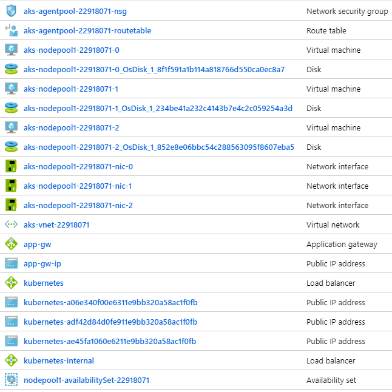

# AKS Walk Through
#### 100 level

## Scenario
In this walk through of AKS basics, we're going to create an AKS cluster and deploy services to the cluster. Much of the code is based on <https://docs.microsoft.com/en-us/azure/aks/kubernetes-walkthrough> but additional details and scenarios are covered. Note that this is a high level overview, so a lot of topics are not covered and those that are covered are high level. This is designed to be the first few steps on the AKS journey. 

All deployments are done using the "declarative" approach - read more here: <https://kubernetes.io/docs/concepts/overview/object-management-kubectl/declarative-config/>

After creating the cluster,  we will deploy a simple web app. This will create an Azure Public IP address and and a public Azure Load Balancer. We will also use kubectl to execute commands on a running container, including an interactive bash shell.

Next, we will deploy a backend service based on the standard Redis Docker container, demonstrating how to connect to containers in the cluster via port forwarding. 

Next we will deploy a web front end which uses the Redis backend as a server. This will automatically create an Azure Public IP address and reconfigure the Azure Load Balancer.

Next we will create a web app that uses a private load balancer and setup Azure Application Gateway to provide HTTPS termination and support.

Lastly, we'll delete everything.

The full walk through takes about 90 minutes.

### Additional Reading
* AKS: <https://docs.microsoft.com/en-us/azure/aks/>
* Kubernetes: <https://kubernetes.io/docs/home/>
* Microsoft Cloud Workshop: <https://github.com/Microsoft/MCW-Containers-and-DevOps>
* What the Hack - k8s: <https://github.com/Microsoft/WhatTheHack/tree/master/001-IntroToKubernetes>

## Prerequisites

* Azure subscription
* Access to Azure Portal and Azure Cloud Shell
* A good attitude (this is a beta!)

## Let's get started

Open the Azure Portal in a new window <https://portal.azure.com>

This walk through uses Azure Cloud Shell (click on the >_ icon in the top header)

If this is your first time using Azure Cloud Shell, installation instructions are [here](cloudshell.md)

### Clone this repo

```

git clone https://github.com/bartr/aks-quickstart

cd aks-quickstart

```

### If you have more than one subscriptions - select the one you want to use

```

# show default subscription
az account show -o table

# list all subscriptions
az account list -o table

# change your default subscription if desired
az account set -s <your-subscription>

```

### Create a Docker build server and AKS Cluster

```

# this takes a while
./setup

```

### What this did
If you check the Azure portal, you will see that this command created two resource groups - aks and MC_aks_aks_centralus. The aks resource group contains the AKS service (Controller) and the Docker build VM. The MC_aks_aks_centralus resource group contains the k8s nodes. Here is a screen shot of what is created in the MC_aks_aks_centralus resource group. You will notice that there are 3 Nodes (VMs).


### ssh into the build server

Get the address of the build server

```

export DHOST="aks@`az network public-ip show -g $ACRRG -n dockerPublicIP --query [ipAddress] -o tsv`" && echo $DHOST

```

Open a command prompt or terminal window and enter the following command substituting the address of your build server. The rest of the walkthrough will be done from this terminal window.

ssh aks@xxx.xxx.xxx.xxx

When prompted for a password enter Kubernetes-k8s

(note that this is NOT a secure VM and you should always use private keys instead of passwords)

Your prompt should look like this:

aks@docker:~$

### Make sure post install script has completed

```

# should return ready
cat status

# if not complete, wait until it is and then run this command
source .profile

```

### Docker walk through

If you're not familiar with Docker, here's a quick [walk through](docker.md)


### Login and select your Azure subscription

If you did this during the Docker walk through, you can skip this step.

```

# Follow the prompts to register the client
az login

```

### If you want to change to a different subscription

```

# show default subscription
az account show -o table

# show default subscription
az account show -o table

# list all subscriptions
az account list -o table

# change your default subscription if desired
az account set -s <your-subscription>

```

### Get the k8s credentials and save in ~/.kube/config

```

az aks get-credentials -g $AKSRG -n $AKSNAME

cat ~/.kube/config

```

### Wait for the nodes to be ready

```

kubectl get nodes

```

### Azure Container Registry

```
# ACR_NAME has to be a unique DNS address
# use ping to check uniqueness
# if you don't get "Name or service not known", change ACR_NAME until you do

ACR_NAME=youralias1234
ping ${ACR_NAME}.azurecr.io

# create the Azure container registry
az acr create -g $ACRRG -n $ACR_NAME --sku Basic

# If ACR_NAME is not unique, you'll get an error - change ACR_NAME and try again

# login to ACR
az acr login -n $ACR_NAME

# Assign role to service principal
# this lets AKS pull images securely from ACR
ACR_ID=$(az acr show -n $ACR_NAME -g acr --query "id" --output tsv)
APP_ID=$(az ad sp show --id http://$ACR_SP --query appId --output tsv)
az role assignment create --assignee $APP_ID --scope $ACR_ID --role Reader

# build and push a docker image
cd ~/go-web-aks

# local build
docker build -t ${ACR_NAME}.azurecr.io/gowebacr .
docker push ${ACR_NAME}.azurecr.io/gowebacr

# List images in ACR
az acr repository list -n $ACR_NAME

# ACR build (and push)
az acr build --registry $ACR_NAME  --image gowebacr2 --file dockerfile .

# List images in ACR
az acr repository list -n $ACR_NAME

# Run the container in AKS
kubectl create deployment gowebacr --image ${ACR_NAME}.azurecr.io/gowebacr

kubectl get pods

kubectl describe pods gowebacr

kubectl get deploy gowebacr -o yaml

kubectl delete deploy gowebacr

```

### Some basic commands

kubectl is the Kubernetes CLI. 

setenv (which runs in .profile) creates a "k" alias to make typing easier, so you can type k instead of kubectl

```

# see what's running
kubectl get all

# Run an app (technically, create a deployment)
kubectl create deployment goweb --image=${ACR_NAME}.azurecr.io/gowebacr

# see what was created
kubectl get all

# get the name of the pod
GW=`kubectl get pod | grep goweb` && set -- $GW && GW=$1 && echo $GW

# Check the logs
kubectl logs $GW

# run shell commands
# these commands execute inside your running container

kubectl exec $GW -- ls -al www

# check the local website
kubectl exec $GW -- curl localhost:8080
kubectl exec $GW -- curl localhost:8080/healthcheck

# check the logs again
kubectl logs $GW

# run an interactive shell
kubectl exec -it $GW -- sh

# notice your prompt changes - you are now inside the container

# run some shell commands
ls -al
cat logs/app.log

# the container uses a minimized version of Alpine, so few utilities exist

exit

```

### Port forwarding

You can use port forwarding to expose the port to the local host. This will work on a deployment, service, pod, etc.

```

# start port forwarding in the background
# you may have to press enter twice to get your prompt back
kubectl port-forward deploy/goweb 8080:8080 &

# this will also work by using the pod - but not at the same time!
kubectl port-forward $GW 8080:8080 &

# run curl
curl localhost:8080
curl localhost:8080/healthcheck

# bring to foreground and cancel
fg
# press <ctl> c to end port forwarding

# check the logs again
kubectl logs $GW

```

### Exposing the web app to the cluster

```

# Create a second deployment
kubectl create deployment gw --image=${ACR_NAME}.azurecr.io/gowebacr

# Create a service (ClusterIP) that exposes the web site on port 80
kubectl expose deployment gw --port=80 --target-port=8080 --name gw

# test the new web site
exec $GW -- curl gw
exec $GW -- curl gw/healthcheck

```

### Delete the deployments

```

kubectl delete deploy goweb
kubectl delete svc,deploy gw
kubectl get all

```

### Declarative Deployments

The preferred way to use k8s is to use the declarative approach which uses yaml files. Since yaml files are text files, they are easy to manage with source code control which makes building a cluster from scratch repeatable.

Read more here: <https://kubernetes.io/docs/concepts/overview/object-management-kubectl/declarative-config/>

k8s has the ability to generate starter yaml files for you.

```

# generate a simple yaml file
kubectl create deployment goweb --image=${ACR_NAME}.azurecr.io/gowebacr --dry-run -o yaml

```

Output should look like this

```
apiVersion: apps/v1
kind: Deployment
metadata:
  labels:
    app: goweb
  name: goweb
spec:
  replicas: 1
  selector:
    matchLabels:
      app: goweb
  template:
    metadata:
      labels:
        app: goweb
    spec:
      containers:
      - image: ACR_NAME.azurecr.io/gowebacr
        name: gowebacr

```

Generate sample yaml for a LoadBalancer

```

kubectl create svc loadbalancer goweb --tcp=80:8080 --dry-run -o yaml

```

Output should look like this

```
apiVersion: v1
kind: Service
metadata:
  labels:
    app: goweb
  name: goweb
spec:
  ports:
  - name: web
    port: 80
    protocol: TCP
    targetPort: 8080
  selector:
    app: goweb
  type: LoadBalancer

```


### Deploy a simple web app

This is a simple web app without any dependencies. Because replicas is set to 3, there will be 3 instances running. AKS will create an Azure Load Balancer and a Public IP Address. The Azure Load Balancer sends traffic to each pod. Note that Azure Load Balancer keeps the TCP connection alive, so you will connect to the same node for up to 5 minutes if you hit refresh.

The source code for the web app is available here: <https://github.com/bartr/go-web-aks>


```

kubectl apply -f webapp

# Wait for service to start
kubectl get svc webapp

# Wait for the public IP

# curl the public IP
w=`kubectl get svc | grep webapp` && set -- $w && w=$4 && echo $w
curl $w

```

If you look in the webapp directory, you will notice that the service definition and the deployment are in separate files. Since the service creates an Azure Load Balancer, having the files separate makes it easy to modify a deployment without accidentally affecting the Azure Load Balancer.

```

# Delete the deployment (but not the service)
kubectl delete -f webapp/deploy.yaml
kubectl get pods

# Redeploy the web app
kubectl apply -f webapp

# Notice that the service (public IP) doesn't change but the pods (deployment) do

kubectl get svc,pods

```


### Node Resource Group

Notice that AKS added a Public IP and Load Balancer during deployment. The YAML in webapp/svc.yaml specifies "LoadBalancer" as the type of service which AKS maps to an Azure Load Balancer.


### Create and deploy a Redis server

```

kubectl apply -f redis

# Wait for the app to start
kubectl get pods

```

## Connect to the Redis container

```

# Start port forarding in background
kubectl port-forward svc/redis 6379:6379 &

# wait for port to be forwarded
# need to press enter to get back to prompt

# Run some Redis commands
bin/redis-cli

#Redis prompt
set Dogs 100
set Cats 1

get Dogs
get Cats

exit

# bash prompt
# Stop Port Forwarding
fg
# press <ctl> c

# A simpler way
redis=`k get pods | grep redis` && set -- $redis && redis=$1 && echo $redis

kubectl exec -it $redis -- redis-cli

incr Dogs
incr Cats
exit

```

### Create and deploy the votes web app

This is a web app that uses the Redis server for persistance.

```

kubectl apply -f votes

# Wait for the public IP
kubectl get svc votes

# get the public IP
v=`kubectl get svc | grep votes` && set -- $v && v=$4 && echo $v

# curl the public IP
curl $v

```

### Node Resource Group

Notice that AKS added a Public IP and reconfigured the Load Balancer as part of the deployment. The YAML in votes/svc.yaml specifies "LoadBalancer" as the type of service.


### Setting up Azure Application Gateway

These steps will setup an Azure Application Gateway with WAF support that points to a new app-gw service. Application Gateway provides https termination services as well as WAF protection to the k8s service. The app-gw service uses an internal load balancer so the IP is only accessible from within the VNET. This is a more secure way of exposing public endpoints. The template sets up automatic redirection of http to https on the Azure Application Gateway so all requests that reach the endpoint are over https. This section is optional and takes about 30 minutes.

```

# create the app
kubectl apply -f app-gw

# wait for service / pods to start
kubectl get svc,pods

# Create the app gateway subnet
# This has to be an empty subnet
MCVNET=`az network vnet list -g $MCRG --query '[0].[name]' -o tsv` && echo $MCVNET
az network vnet subnet create --name app-gw-subnet --resource-group $MCRG --vnet-name $MCVNET --address-prefix 10.0.0.0/24

# change to the setup directory
cd app-gw/setup

# Edit app-gw.json

# change the vnet to
echo $MCVNET

# change backendIpAddress to:
kubectl get svc app-gw -o json | jq .status.loadBalancer.ingress[0].ip

# Deploy app-gw.json
# This takes 15-30 minutes
az group deployment create --name app-gw-deployment -g $MCRG --template-file app-gw.json --no-wait

# Make sure app gateway is "ready"
az network application-gateway show -g $MCRG --name app-gw -o table

# get the app gateway public IP address
echo "http://`az network public-ip show -g $MCRG --name app-gw-ip --query [ipAddress] --output tsv`"

# Browse to the url
# you should be automatically redirected to https
# note that we use a self-signed cert, so you will get a warning from your browser

```

### Final Resource Group

Notice that AKS added a Public IP and reconfigured the Load Balancer after you deployed the votes service. The YAML in votes/svc.yaml specifies "LoadBalancer" as the type of service.



### Clean up

```
# exit to Azure Cloud Shell
exit

# Delete resource groups
az group delete -y --no-wait -g $AKSRG
az group delete -y --no-wait -g $ACRRG
az group delete -y --no-wait -g MC_${AKSRG}_${AKSNAME}_${AKSLOC}

# Delete service principal
az ad sp delete --id $APP_ID

# resource groups should show "deleting"
az group list -o table

```
