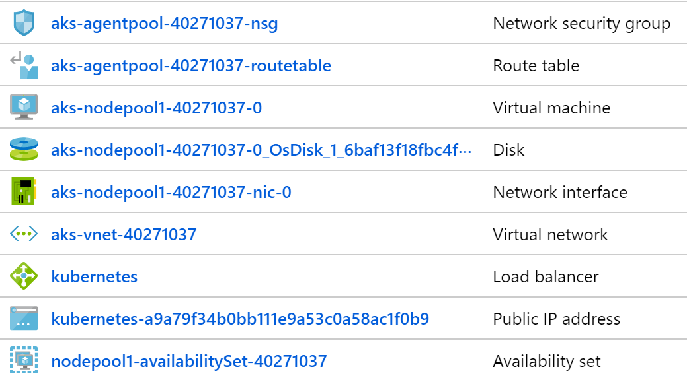

# AKS Walk Through
#### 100 level

## Scenario
In this walk through of AKS basics, we're going to create an AKS cluster and deploy services to the cluster. Much of the code is based on <https://docs.microsoft.com/en-us/azure/aks/kubernetes-walkthrough> but additional details and scenarios are covered. Note that this is a high level overview, so a lot of topics are not covered and those that are covered are high level. This is designed to be the first few steps on the AKS journey. 

All deployments are done using the "declarative" approach - read more here: <https://kubernetes.io/docs/concepts/overview/object-management-kubectl/declarative-config/>

After creating the cluster,  we will deploy a simple web app. This will create an Azure Public IP address and and a public Azure Load Balancer. We will also use kubectl to execute commands on a running container, including an interactive bash shell.

Next, we will deploy a backend service based on the standard Redis Docker container, demonstrating how to connect to containers in the cluster via port forwarding. 

Next we will deploy a web front end which uses the Redis backend as a server. This will automatically create an Azure Public IP address and reconfigure the Azure Load Balancer.

Next we will create a web app that uses a private load balancer and setup Azure Application Gateway to provide HTTPS termination and support.

Lastly, we'll delete everything.

The full walk through takes about 90 minutes.

### Additional Reading
* AKS: <https://docs.microsoft.com/en-us/azure/aks/>
* Kubernetes: <https://kubernetes.io/docs/home/>

## Prerequisites

This walk through has been tested using Azure Cloud Shell (bash), Mac terminal and Ubuntu (bash).

Everything you need is installed in Azure Cloud Shell. If you're using Mac or Ubuntu, you will need to install the Azure CLI. <https://docs.microsoft.com/en-us/cli/azure/install-azure-cli>

You will also need to install the Kubernetes CLI.

```
# Install kubectl
az aks install-cli
```

## Let's get started

### Set environment variables

The walk through uses these environment variables extensively. Setting the environment variables is neccesary to support copying and pasting the commands into bash.

AKS is not currently available in all regions, so we'll need to pick a region where it is available. The default in setenv is CentralUS. We also need to verify that whatever size VMs we use for nodes are available in that region as well. The default in setenv is Standard_D2s_v3. You can change these by editing setenv.

```
# Clone this repo
git clone https://github.com/bartr/aks-quickstart

# edit setenv to use your values

source setenv
```

### List of regions where AKS is available

<https://docs.microsoft.com/en-us/azure/aks/container-service-quotas>

### List of VM Sizes in your region

```
az vm list-sizes -l $AKSLOC -o table | grep s_v3
```

### Login and select your Azure subscription

```
# Optional if you're already logged in and have the subscription default set
az login
az account set -s $AKSSUB
```

### Create a resource group and AKS Cluster

If you add AKS to an existing Resource Group, *DO NOT* delete the Resource Group in the cleanup stage!

```
az group create -l $AKSLOC -g $AKSRG

# this takes a while
az aks create -g $AKSRG -n $AKSNAME -c 3 -s $AKSSIZE
```

### What this did
If you check the Azure portal, you will see that this command created two resource groups - AKSRG and MC_AKSRG_AKSNAME_AKSLOC. The AKS resource group contains the AKS service (Controller). The other resource group contains the k8s nodes. Here is a screen shot of what is created in the nodes subscription. You will notice that there are 3 Nodes (VMs).


### Get the k8s credentials and save in ~/.kube/config

```
az aks get-credentials -g $AKSRG -n $AKSNAME

# Note: if you run this walk through repeatedly, you will need to edit / delete ~/.kube/control before running this command
```

### Wait for the nodes to be ready

```
kubectl get nodes
```

### Some basic commands

If you're familiar with Docker, many of these commands will look similar.

kubectl is the Kubernetes CLI. setenv creates the "k" alias to make typing easier.

```
# see what's running
kubectl get all

# Run an app (technically, create a deployment)
kubectl create deployment goweb --image=bartr/go-web-aks

# see what was created
kubectl get all

# get the name of the app
kubectl get pods

# You should see something like this
NAME                      READY   STATUS    RESTARTS   AGE
goweb-64b448b6b8-blfsk    1/1     Running   0          99s

# set an environment variable with the name from your output
GW=goweb-64b448b6b8-blfsk

# Check the logs
kubectl logs $GW

# run shell commands
kubectl exec $GW -- pwd
kubectl exec $GW -- ls -al www

# check the local website
# curl has to be installed in the container
kubectl exec $GW -- curl localhost:8080
kubectl exec $GW -- curl localhost:8080/healthcheck

# check the logs again
kubectl logs $GW

# run an interactive shell
kubectl exec -it $GW -- sh

# run some shell commands
# the container uses a very small version of Alpine, so few utilities exist

exit
```

### Port forwarding

You can use port forwarding to expose the port to the local shell. This will work on a deployment, service, pod, etc.

```
# start port forwarding in the background
kubectl port-forward deploy/goweb 8080:8080 &

# this will also work
kubectl port-forward $GW 8080:8080 &

# run curl
curl localhost:8080
curl localhost:8080/healthcheck

# bring to foreground and cancel
fg
# press <ctl> c to end port forwarding

# check the logs again
kubectl logs $GW

```

### Exposing the web app to the cluster

```
# Create a second deployment
kubectl create deployment gw --image=bartr/go-web-aks

# Create a service (ClusterIP) that exposes the web site on port 80
kubectl expose deployment gw --port=8080 --target-port=8080 --name gw

# test the new web site
kubectl exec -it $GW -- sh

curl gw
curl gw/healthcheck

exit

```

### Delete the deployments

```
kubectl delete deploy goweb
kubectl delete svc,deploy gw
kubectl get all

```

### Declarative Deployments

The preferred way to use k8s is to use the declarative approach which uses yaml files. Since yaml files are text files, they are easy to manage with source code control which makes building a cluster from scratch repeatable.

Read more here: <https://kubernetes.io/docs/concepts/overview/object-management-kubectl/declarative-config/>

k8s has the ability to generate starter yaml files for you.

```
# generate a simple yaml file
kubectl create deployment goweb --image=bartr/go-web-aks --dry-run -o yaml
```

Output should look like this

```
apiVersion: apps/v1
kind: Deployment
metadata:
  labels:
    app: goweb
  name: goweb
spec:
  replicas: 1
  selector:
    matchLabels:
      app: goweb
  template:
    metadata:
      labels:
        app: goweb
    spec:
      containers:
      - image: bartr/go-web-aks
        name: go-web-aks

```

Generate sample yaml for a LoadBalancer

```
kubectl create svc loadbalancer goweb --tcp=80:8080 --dry-run -o yaml
```

Output should look like this

```
apiVersion: v1
kind: Service
metadata:
  labels:
    app: goweb
  name: goweb
spec:
  ports:
  - name: web
    port: 80
    protocol: TCP
    targetPort: 8080
  selector:
    app: goweb
  type: LoadBalancer

```


### Deploy a simple web app

This is a simple web app without any dependencies. Because replicas is set to 3, there will be 3 instances running. AKS will create an Azure Load Balancer and a Public IP Address. The Azure Load Balancer sends traffic to each pod. Note that Azure Load Balancer keeps the TCP connection alive, so you will connect to the same node for up to 5 minutes if you hit refresh.

The source code for the web app is available here: <https://github.com/bartr/go-web-aks>  The Application Gateway walk through uses the same web app.


```
kubectl apply -f webapp

# Wait for service to start
kubectl get svc,pods

# Browse to public IP
```

If you look in the webapp directory, you will notice that the service definition and the deployment are in separate files. Since the service creates an Azure Load Balancer, having the files separate makes it easy to modify a deployment without affecting the Azure Load Balancer.

```
# Delete the deployment (but not the service)
kubectl delete -f webapp/deploy.yaml
kubectl get pods

# Redeploy the web app
kubectl apply -f webapp

# Notice that the service (public IP) doesn't change but the pods (deployment) does

kubectl get svc,pods

```


### Node Resource Group

Notice that AKS added a Public IP and Load Balancer during deployment. The YAML in webapp/svc.yaml specifies "LoadBalancer" as the type of service which AKS maps to an Azure Load Balancer.


### Create and deploy a Redis server

```
kubectl apply -f redis

# Wait for the app to start
kubectl get deploy,pods
```

## Connect to the Redis container

```
# Start port forarding in background
kubectl port-forward svc/redis 6379:6379 &

# wait for port to be forwarded
# need to press enter to get back to prompt

# Run some Redis commands
bin/redis-cli

#Redis prompt
set Dogs 10
set Cats 1

get Dogs
get Cats

exit

# bash prompt
# Stop Port Forwarding
fg
# press <ctl> c
```

### Create and deploy frontend web app

This is a Java web app that uses the Redis server for persistance.

```
kubectl apply -f votes

# Get the public IP
kubectl get svc votes

# browse to public IP to test app
```

### Node Resource Group

Notice that AKS added a Public IP and reconfigured the Load Balancer as part of the deployment. The YAML in frontend/svc.yaml specifies "LoadBalancer" as the type of service.



### Setting up Azure Application Gateway

These steps will setup an Azure Application Gateway with WAF support that points to a new app-gw service. Application Gateway provides https termination services as well as WAF protection to the k8s service. The app-gw service uses an internal load balancer so the IP is only accessible from within the VNET. This is a more secure way of exposing public endpoints. The template sets up automatic redirection of http to https on the Azure Application Gateway so all requests that reach the endpoint are over https. This section is optional and takes about 30 minutes.

```
# create the app
kubectl apply -f app-gw

# wait for service / pod to start
kubectl get svc,pods

# test the web app
# setup port forwarding for the web app
kubectl port-forward svc/app-gw 8080:8080 &

curl localhost:8080

# end port forwarding
fg
# press <ctl> c

# Create the app gateway subnet
# This has to be an empty subnet
MCVNET=`az network vnet list -g $MCRG --query '[0].[name]' -o tsv`
az network vnet subnet create --name app-gw-subnet --resource-group $MCRG --vnet-name $MCVNET --address-prefix 10.0.0.0/24

# change to the setup directory
cd app-gw/setup

# Edit app-gw.json

# change the vnet to
echo $MCVNET

# change backendIpAddress to:
kubectl get svc app-gw -o json | jq .status.loadBalancer.ingress[0].ip

# change the certificate data and password if you use a different cert
cat cert.pfx | base64 -w 0

# Deploy app-gw.json
# This takes 15-30 minutes
az group deployment create --name app-gw-deployment -g $MCRG --template-file app-gw.json

# Make sure app gateway is "ready"
az network application-gateway show -g $MCRG --name app-gw -o table

# get the app gateway public IP address
az network public-ip show -g $MCRG --name app-gw-ip --query [ipAddress] --output tsv

# Browse to http://app-gw-public-ip/
# you should be automatically redirected to https
# note that cert.pfx is a self-signed cert, so you will get a warning from your browser
# the cert is setup for 4.co and www.4.co, so you can add an entry to your hosts file with the IP (optional)

```

### Final Resource Group

Notice that AKS added a Public IP and reconfigured the Load Balancer after you deployed the frontend service. The YAML in frontend/svc.yaml specifies "LoadBalancer" as the type of service.


### Helm Walk Through

There is an optional Helm walk through here: helm.md

### Clean up

```
# Delete resource groups
az group delete -y --no-wait -g $AKSRG
az group delete -y --no-wait -g MC_${AKSRG}_${AKSNAME}_${AKSLOC}
az group list -o table

# Only remove this file if this is the only k8s cluster in the file. Otherwise, edit the file and remove the key information

rm ~/.kube/config

```
